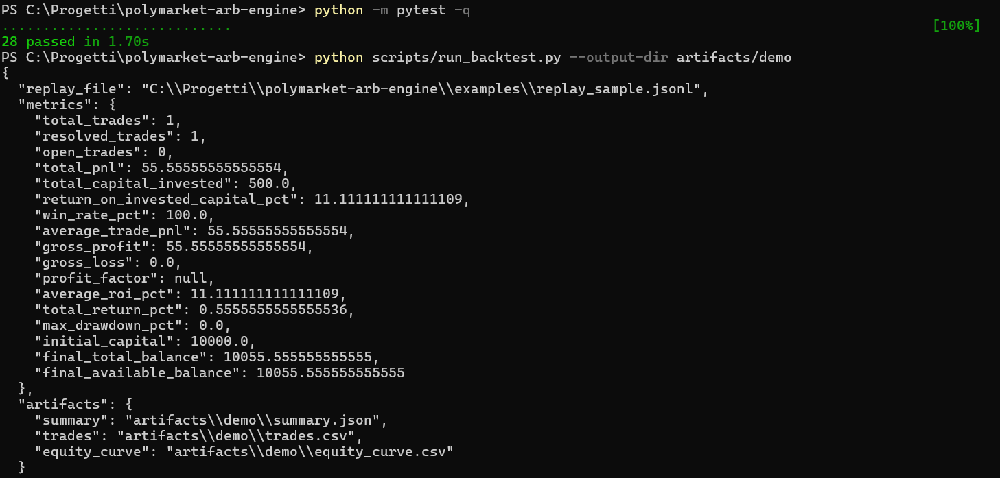
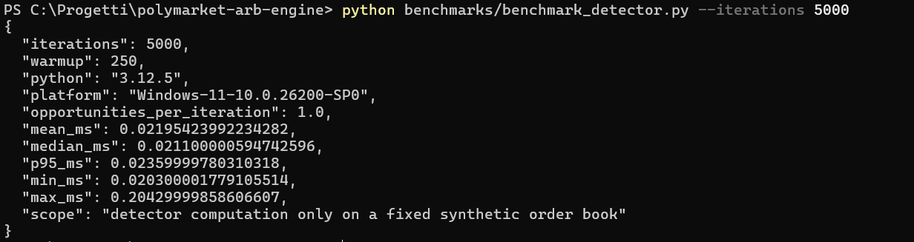
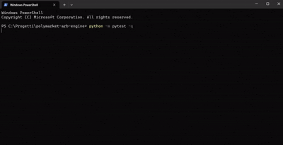

# Polymarket Quantitative Arbitrage Engine

Real-time **paper-trading** research engine for detecting complementary-outcome mispricing on Polymarket.

The project consumes public CLOB market data, maintains in-memory order books, estimates executable prices including order-book slippage and configurable taker fees, detects structural arbitrage candidates, and applies portfolio risk limits.

**Scope:** the current implementation is read-only / paper-trading. It does not submit live orders and does not claim production or HFT performance.






## Architecture

~~~text
Gamma / CLOB REST
       |
       v
Market discovery + metadata
       |
       v
Market WebSocket
(book + price_change events)
       |
       v
In-memory order-book state
       |
       v
Pricing / execution simulation
       |
       v
Arbitrage detector
       |
       v
Risk manager
       |
       v
Paper trade / backtest
~~~

### Main modules

- **src/data** — REST market discovery and resilient WebSocket ingestion.
- **src/core** — typed market, token, order-book, opportunity and portfolio models.
- **src/pricing** — order-book walking, VWAP, slippage and fee-aware executable cost.
- **src/detectors** — structural complementary-outcome arbitrage detector.
- **src/risk** — Kelly-based sizing plus hard exposure and liquidity limits.
- **src/live** — live market-data paper-trading loop.
- **src/backtest** — event-driven simulation, JSONL replay and performance metrics.
- **tests** — unit tests for data ingestion, pricing, detection, risk and backtesting.

## Arbitrage logic

For a binary market with mutually exclusive outcomes, buying one share of YES and one share of NO produces a fixed $1 settlement value.

The detector therefore looks for an effective combined executable cost below a configurable threshold:

~~~text
effective YES ask + effective NO ask < threshold
~~~

The pricing engine walks both order books instead of relying only on the displayed midpoint or top-of-book price. This lets the detector estimate executable size, VWAP and slippage.

## Fees

Polymarket currently applies taker fees to certain market categories. Its July 2026 fee documentation gives the formula:

~~~text
fee = shares × feeRate × price × (1 - price)
~~~

Fee parameters differ by market category, and some markets are fee-free. The engine reads fee metadata when available and keeps a configurable fallback rate for simulations. Venue-specific rounding is not reproduced.

## WebSocket market data

The public market channel provides full `book` snapshots and incremental `price_change` events. The client sends a text `PING` every 10 seconds, ignores `PONG`, reconnects with exponential backoff, and applies `price_change` updates to the in-memory book.

A `price_change` with size `0` removes that price level.

## Risk model

Sizing is kept separate from detection:

1. Estimate the executable average cost.
2. Compute a Kelly fraction from the configured success probability.
3. Apply the fractional-Kelly multiplier.
4. Cap by exposure, available balance and executable liquidity.

The example runner's 99% success probability is a configurable simulation assumption, not a measured probability estimate.

## Backtesting and replay

The repository now separates the backtest engine from the data source. `src/backtest/replay.py` provides a deterministic JSONL replay feed with monotonic timestamp validation, while `src/backtest/engine.py` handles entry, capital locking, binary settlement and equity tracking.

A replay event has three parts: `timestamp`, a validated `market` snapshot, and an `order_books` mapping. The included `examples/replay_sample.jsonl` is intentionally synthetic and exists only as a reproducible smoke test; it is **not** historical market data and should not be presented as evidence of strategy profitability.

Trade-level outputs include total/resolved/open trades, PnL, return on invested capital, win rate, average trade PnL, gross profit/loss and profit factor. The engine also exposes an equity curve for drawdown analysis.

Run the example replay with:

~~~bash
python scripts/run_backtest.py
~~~

Or provide another captured JSONL replay:

~~~bash
python scripts/run_backtest.py path/to/replay.jsonl --capital 10000
~~~

## Performance

The runtime includes local market-data processing instrumentation. No independently reproducible end-to-end benchmark is published in this repository, so there are no hard HFT or sub-millisecond performance claims.

## Installation

~~~bash
python -m venv .venv
# activate the environment
pip install -r requirements.txt
~~~

Run the paper-trading loop:

~~~bash
python run_live.py
~~~

Or build the Docker image:

~~~bash
docker build -t polymarket-arb-engine .
docker run --rm polymarket-arb-engine
~~~

## Testing

~~~bash
pytest -q
~~~

Optional static checks:

~~~bash
ruff check .
mypy src
~~~

## Continuous integration

GitHub Actions runs the test suite on Python 3.11 and 3.12 and performs a Ruff lint check on pushes to `main` and pull requests.

## Current limitations

- Binary complementary-outcome strategy only.
- Public market data only.
- Paper execution only.
- Synthetic backtest fixtures only.
- No live order submission.
- No exchange-authenticated order submission and no venue-calibrated execution-latency model.

## References

- Polymarket market WebSocket documentation / examples: `Polymarket/agent-skills` WebSocket guide.
- Polymarket fee documentation: Trading Fees Help Center article, July 2026.

## Reproducible configuration and outputs

The replay runner exposes the key simulation parameters on the command line (`--threshold`, `--fee-rate`, `--win-probability`, `--max-exposure`, `--kelly-multiplier`). This avoids hidden risk settings inside the backtest engine.

To export machine-readable artifacts:

```bash
python scripts/run_backtest.py --output-dir artifacts/example
```

The command writes a JSON summary plus a trade ledger and equity-curve CSV. The `artifacts/` directory is ignored by Git so generated results do not pollute the source tree.

