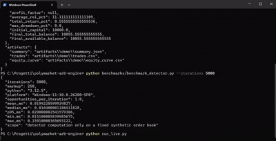
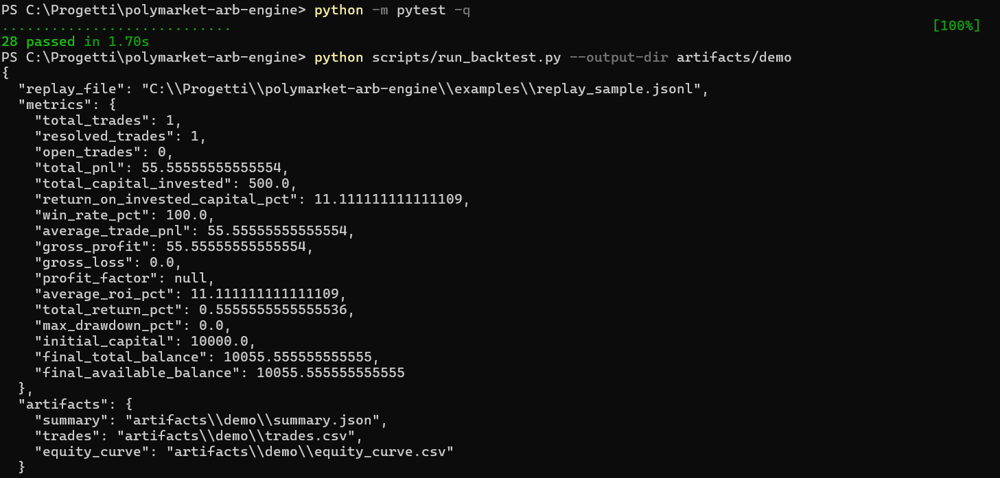
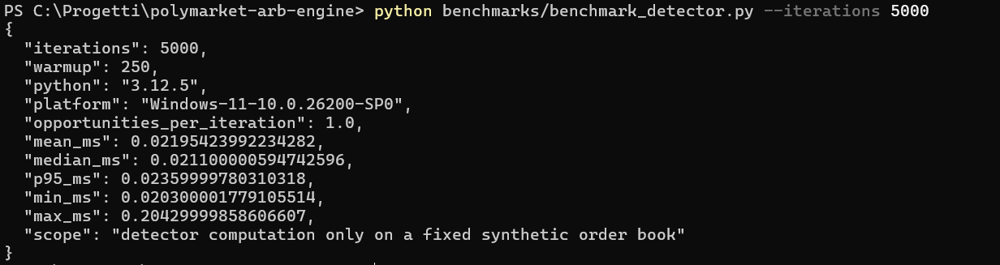

# ⚡ Polymarket Arbitrage Engine

**A real-time, event-driven research engine that detects structural mispricing on Polymarket order books, sizes positions under hard risk limits, and validates ideas through deterministic, reproducible backtests.**




> **Honest scope:** read-only / paper trading. No live order submission, no HFT claims, and the bundled backtest data is synthetic. This project is about engineering and methodology, not a profitability pitch.

---

## 🎯 Why this project

Prediction markets are a compact, well-defined playground for quantitative engineering: streaming data, order-book state, execution costs, risk, and honest evaluation. This project ties them together end to end:

| Problem | How it is handled |
|---|---|
| Streaming market data is unreliable | Resilient WebSocket client: 10s `PING` heartbeat, exponential-backoff reconnect, incremental `price_change` updates applied to in-memory books |
| Top-of-book prices are misleading | Pricing engine **walks the order book** to compute executable VWAP and slippage for a given size |
| Fees erode edge | Fee-aware cost using Polymarket's formula `fee = shares × feeRate × p × (1 − p)`, read from market metadata with a configurable fallback |
| Sizing is where strategies blow up | Fractional Kelly sizing, capped by exposure, balance and available liquidity, kept separate from detection |
| Backtests are easy to fool yourself with | Deterministic JSONL replay with monotonic timestamp validation, capital locking, binary settlement, and exported artifacts |

## 🧠 The strategy in one minute

In a binary market, one YES share plus one NO share always settles at **$1**. If the *effective executable cost* of buying both (after slippage and fees) is below a threshold, a structural arbitrage candidate exists:

```
effective YES ask + effective NO ask < threshold
```

The detector evaluates this on real book depth, not on midpoints.

## 🏗️ Architecture

```
Gamma / CLOB REST  →  Market discovery + metadata
                              │
                              ▼
                    Market WebSocket (book + price_change)
                              │
                              ▼
                    In-memory order-book state
                              │
                              ▼
                    Pricing / execution simulation
                              │
                              ▼
                    Arbitrage detector  →  Risk manager  →  Paper trade / Backtest
```

| Module | Responsibility |
|---|---|
| `src/data` | REST discovery and WebSocket ingestion |
| `src/core` | Typed models: market, token, order book, opportunity, portfolio |
| `src/pricing` | Book walking, VWAP, slippage, fee-aware cost |
| `src/detectors` | Complementary-outcome arbitrage detection |
| `src/risk` | Kelly sizing, exposure and liquidity limits |
| `src/live` | Live paper-trading loop |
| `src/backtest` | Event-driven engine, JSONL replay, performance metrics |

## 📊 Backtesting you can trust (and reproduce)

The data source is decoupled from the engine, so any captured JSONL feed can be replayed identically.

```bash
python scripts/run_backtest.py                                   # bundled synthetic sample
python scripts/run_backtest.py path/to/replay.jsonl --capital 10000
python scripts/run_backtest.py --output-dir artifacts/example    # JSON summary + trade ledger + equity curve CSV
```

Every risk parameter is explicit on the CLI (`--threshold`, `--fee-rate`, `--win-probability`, `--max-exposure`, `--kelly-multiplier`), so there are no hidden settings. Metrics include PnL, return on invested capital, win rate, profit factor and an equity curve for drawdown analysis.




## 🚀 Quickstart

```bash
python -m venv .venv && source .venv/bin/activate
pip install -r requirements.txt

python run_live.py            # live market data, paper trading

# or with Docker
docker build -t polymarket-arb-engine .
docker run --rm polymarket-arb-engine
```

## ✅ Engineering quality

- Unit tests across ingestion, pricing, detection, risk and backtesting: `pytest -q`
- Static checks: `ruff check .` and `mypy src`
- CI on GitHub Actions (Python 3.11 and 3.12, lint + tests on every push and PR)
- Dockerized, `.env.example` for configuration, typed domain models

## 🔍 Design decisions worth discussing

- **Detection and sizing are separate concerns**, so each can be tested and swapped independently.
- **Replay is decoupled from the engine**, which makes results deterministic and auditable.
- **Assumptions are labeled as assumptions**: the 99% success probability in the example runner is a configurable simulation input, not an estimated value.
- **Deliberately no performance claims** without a reproducible benchmark.

## 🗺️ Limitations and roadmap

Current: binary complementary-outcome strategy, public data only, paper execution, synthetic fixtures, no venue-calibrated latency model.

Next:
- [ ] Capture and replay real historical order-book data
- [ ] Latency and partial-fill model calibrated on captured data
- [ ] Multi-outcome (negative-risk) market support
- [ ] Reproducible end-to-end latency benchmark

*Disclaimer: research and educational software, not financial advice.*
